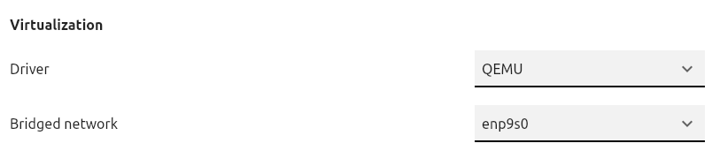

# Multipass instance setup scripts

Scripts for setting up Multipass instances with SSH access and GitHub CLI pre-installed.

- `setup.sh`: set up prerequisites on the host.
- `new_instance.py`: set up a new Multipass instance.
- `init.sh`: initialization script to be run on each new Multipass instance.
- `code.py`: Launch a VS Code remote session (select Multipass instance from menu).

### Network bridging

1. Find your ethernet interface using `multipass networks`.  Note that Multipass cannot create a bridge to wireless networks.  The interface name will usually appear as `enp<x>s<y>`.
2. In the Multipass GUI, select the interface to bridge to under **Settings**.
    
    - Alternatively, execute `multipass set local.bridged-network=<network>`.
3. Newly created Multipass VMs should automatically connect to the new bridge network.
